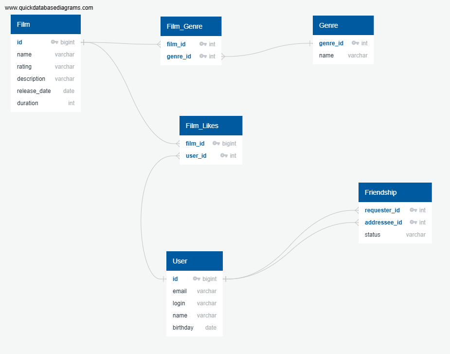

# java-filmorate
Template repository for Filmorate project.


DB for Filmorate:


## Пояснение к схеме базы данных

Данная схема представляет собой реляционную модель для хранения информации о пользователях, фильмах, жанрах, лайках и дружеских связях.

Основные сущности:

- **User** — хранит данные пользователей системы (email, логин, имя и дату рождения).
- **Film** — содержит информацию о фильмах, включая название, описание, рейтинг, дату выхода и продолжительность.
- **Genre** — справочник жанров фильмов.
- **Friendship** — таблица для хранения связей между пользователями. Поддерживает статус дружбы (например, подтверждённая или ожидающая).
- **Film_Likes** — связь пользователей и фильмов, отражающая лайки.
- **Film_Genre** — связующая таблица для реализации связи "многие ко многим" между фильмами и жанрами.

Особенности модели:

- Все связи приведены к третьей нормальной форме (3НФ).
- Связи "многие ко многим" реализованы через промежуточные таблицы (Film_Likes, Film_Genre).
- Дружба между пользователями хранится как направленная связь с дополнительным статусом.
- Модель ориентирована на поддержку типовых операций: получение популярных фильмов, фильтрация по жанрам и анализ пользовательских связей.

Ниже представлены основные запросы для анализа данных в системе фильмов и пользователей.

## Основные SQL-запросы

```sql
-- 1. Топ фильмов по лайкам
SELECT 
    f.name,
    COUNT(fl.user_id) AS likes_count
FROM Film f
LEFT JOIN Film_Likes fl ON f.id = fl.film_id
GROUP BY f.id, f.name
ORDER BY likes_count DESC;

-- 2. Подтверждённые дружеские связи
SELECT 
    fr.requester_id,
    fr.addressee_id
FROM Friendship fr
WHERE fr.status = 'confirmed';

-- 3. Фильмы по жанру (пример: Comedy)
SELECT 
    f.name AS film_name,
    g.name AS genre
FROM Film f
JOIN Film_Genre fg ON f.id = fg.film_id
JOIN Genre g ON fg.genre_id = g.genre_id
WHERE g.name = 'Comedy';
