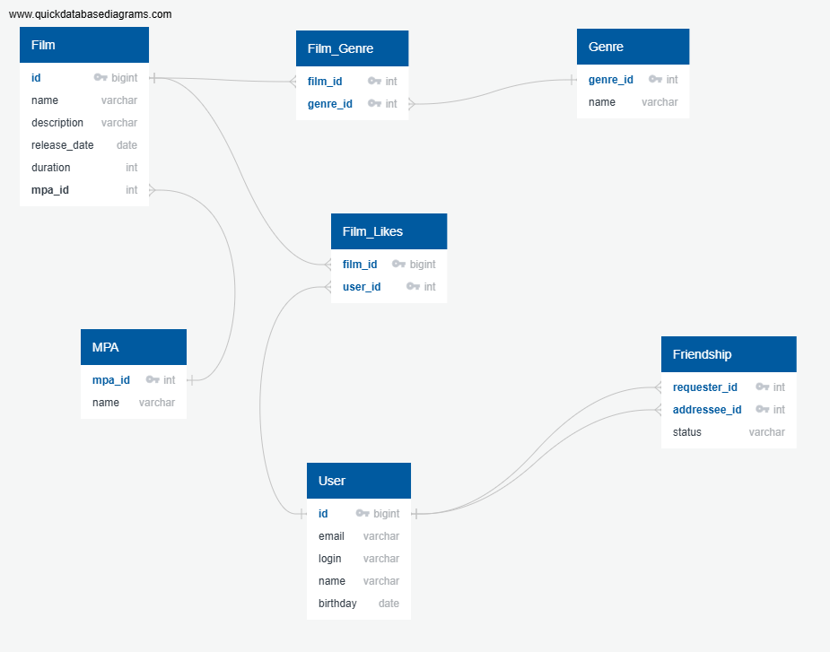

# java-filmorate
Template repository for Filmorate project.


DB for Filmorate:


# Пояснение к схеме базы данных

Данная схема представляет собой реляционную модель базы данных для хранения информации о пользователях, фильмах, рейтингах MPA, жанрах, лайках и дружеских связях между пользователями.

## Основные сущности

* **User** — хранит данные пользователей системы: адрес электронной почты, логин, имя и дату рождения.
* **Film** — содержит информацию о фильмах, включая название, описание, дату выхода, продолжительность и рейтинг MPA.
* **Genre** — справочник жанров фильмов.
* **MPA** — справочник возрастных рейтингов фильмов (*G*, *PG*, *PG-13*, *R*, *NC-17*).
* **Friendship** — таблица для хранения связей между пользователями. Поддерживает статус дружбы, что позволяет различать подтверждённые и неподтверждённые заявки.
* **Film_Likes** — связующая таблица между пользователями и фильмами, фиксирующая поставленные лайки.
* **Film_Genre** — связующая таблица между фильмами и жанрами, реализующая связь типа **«многие ко многим»**.

## Особенности модели

* Все таблицы приведены к **третьей нормальной форме (3НФ)**, что позволяет минимизировать избыточность данных.
* Для хранения жанров и возрастных рейтингов используются отдельные справочники.
* Связи **«многие ко многим»** реализованы через промежуточные таблицы **Film_Likes** и **Film_Genre**.
* Дружба между пользователями хранится как направленная связь с дополнительным атрибутом статуса.
* Использование внешних ключей обеспечивает целостность данных между таблицами.
* Модель ориентирована на поддержку типовых операций сервиса рекомендаций фильмов: поиск популярных фильмов, фильтрацию по жанрам и рейтингам, анализ пользовательских предпочтений и социальных связей.

Ниже представлены основные запросы для анализа данных в системе.

# Основные SQL-запросы

```sql
-- 1. Топ фильмов по количеству лайков
SELECT
    f.name,
    COUNT(fl.user_id) AS likes_count
FROM Film f
LEFT JOIN Film_Likes fl ON f.id = fl.film_id
GROUP BY f.id, f.name
ORDER BY likes_count DESC;

-- 2. Подтверждённые дружеские связи
SELECT
    fr.requester_id,
    fr.addressee_id
FROM Friendship fr
WHERE fr.status = 'confirmed';

-- 3. Список фильмов определённого жанра
SELECT
    f.name AS film_name,
    g.name AS genre
FROM Film f
JOIN Film_Genre fg ON f.id = fg.film_id
JOIN Genre g ON fg.genre_id = g.genre_id
WHERE g.name = 'Comedy';

-- 4. Список фильмов с рейтингом MPA
SELECT
    f.name,
    m.name AS mpa_rating
FROM Film f
JOIN MPA m ON f.mpa_id = m.mpa_id
ORDER BY f.name;

-- 5. Количество лайков каждого пользователя
SELECT
    u.id,
    u.login,
    COUNT(fl.film_id) AS likes_given
FROM User u
LEFT JOIN Film_Likes fl ON u.id = fl.user_id
GROUP BY u.id, u.login
ORDER BY likes_given DESC;

-- 6. Самые популярные жанры по количеству фильмов
SELECT
    g.name,
    COUNT(fg.film_id) AS films_count
FROM Genre g
LEFT JOIN Film_Genre fg ON g.genre_id = fg.genre_id
GROUP BY g.genre_id, g.name
ORDER BY films_count DESC;
```
